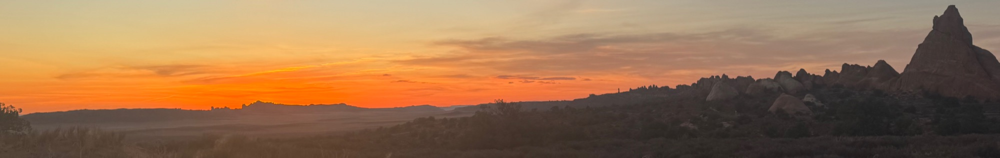

# Who Am I

I'm Nathan Roach, a bioinformatics scientist with a PhD in Biology from Johns Hopkins University. My primary PhD research focused on evaluating and using Oxford Nanopore sequencing data to characterize the full-length transcriptome of *C. elegans* across developmental stages. I worked on a number of other side projects while in academia, gaining experience with hidden Markov models, various methods of *de novo* transcriptome assembly, and analysis of small RNA sequencing data.

After my PhD, I spent a year working at GalaxyWorks, the commercial arm of the [Galaxy Project](https://usegalaxy.org/). During this time I added bioinformatics tools to open-source tool repositories ([bioconda](https://github.com/bioconda/bioconda-recipes/pulls?q=is%3Apr+is%3Aclosed+author%3ANatPRoach), [the Galaxy toolshed](https://github.com/galaxyproject/tools-iuc/pulls?q=is%3Aclosed+is%3Apr+author%3ANatPRoach+)), and built and maintained end-to-end analysis pipelines for pharmaceutical business partners.

Following that, I joined Fulcrum Genomics, a bioinformatics consulting group working with many high-profile customers across the pharmaceutical and biotech industries. As a consulting group, Fulcrum touched almost every aspect of the genomics analysis stack, and in my time there I worked on many things, including managing AWS infrastructure for analysis, building and maintaining open-source genomics toolkits, optimizing the performance and runtime of critical tooling within customer pipelines, setting up new whole-genome sequencing variant calling pipelines from scratch, and auditing and improving legacy codebases. During this time I gained substantial experience working in Rust, workflow languages (including WDL, Nextflow, and Snakemake), and AWS.

I then moved to Bio-Rad, my current employer. While at Bio-Rad I've spent much of my time working on the on-instrument processing for the QX Continuum ddPCR instrument, and writing analyses for upcoming instruments that run both on- and off-instrument. In addition to these external products, in my time at Bio-Rad I've worked on API and analysis layers of data analysis web platforms, set up and managed CI/CD pipelines for large projects spanning multiple teams, created and maintained high-performance tooling (both in genomics and in digital signal processing), and gained experience with architectural design patterns to improve codebase maintainability. I've also honed my soft skills on cross-functional projects, working with product managers and hardware, firmware, and systems engineers.
